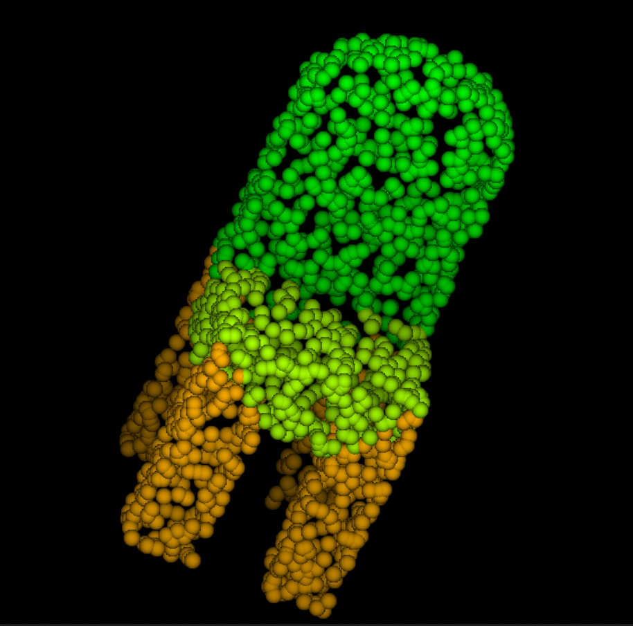
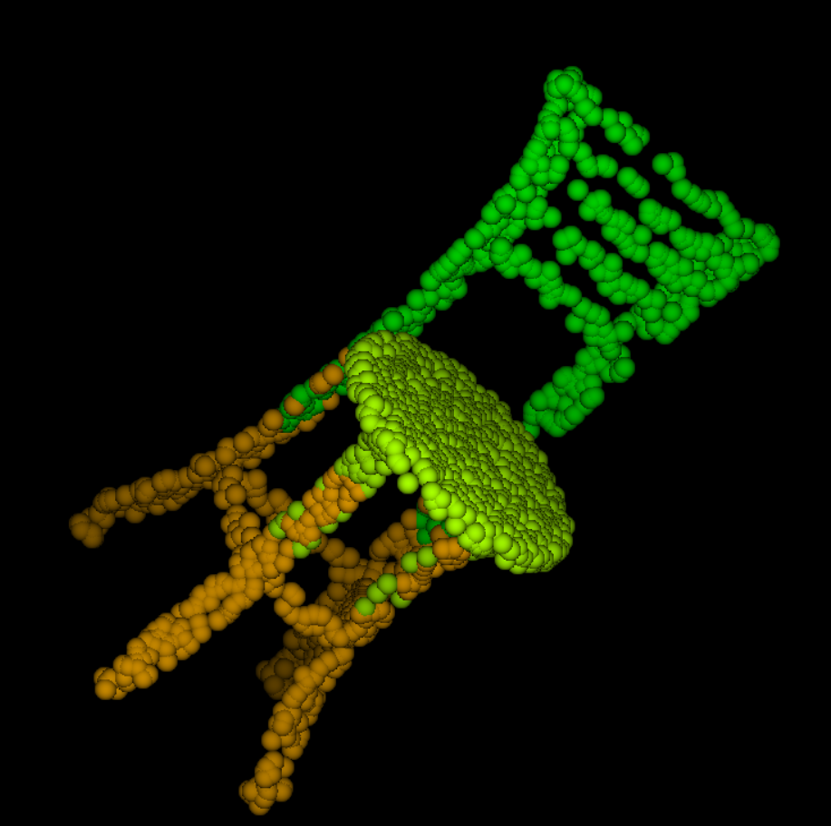
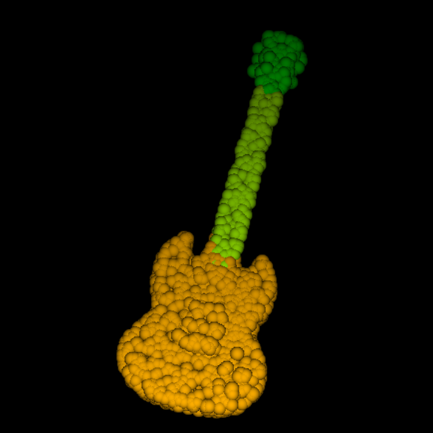
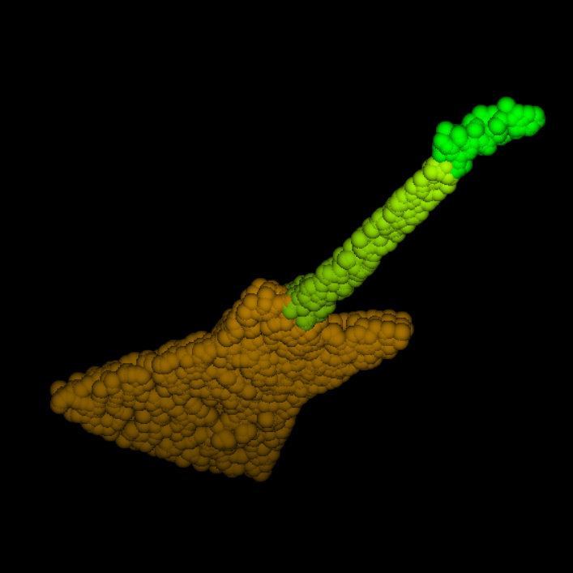

# PointNet
PointNet is a deep neural network designed to do classification and segmentation on 3D point clouds. The network has been implemented in PyTorch.

## Training the classification network

The classification network was trained for 10 epochs, both with feature transform as well as without. The weights were saved for both cases.

    python show_cls.py --model ./cls_FT/cls_model_9.pth --feature_transform
    
    Average Train Accuracy: 0.960422 Average Test Accuracy: 0.948385
    
    python show_cls.py --model ./cls_noFT/cls_model_9.pth
    
    Average Train Accuracy: 0.976830 Average Test Accuracy: 0.957163

## Training the segmentation network

The segmentation network was trained for 10 epochs, both with feature transform as well as without. The weights were saved for both cases. This was done for two classes: Chair and Guitar. 

‘Chair’ Class:

    python train_segmentation.py --dataset ./shapenet/ --nepoch 10 --class_choice Chair --feature_transform
    
    Testing mIOU for class Chair: 0.8156666563399274
    
    Training mIOU for class Chair: 0.7940363590016127
    
    python train_segmentation.py --dataset ./shapenet/ --nepoch 10 --class_choice Chair
    
    Testing mIOU for class Chair: 0.8010046474006883
    
    Training mIOU for class Chair: 0.7939503764027812

‘Guitar’ Class:

    python train_segmentation.py --dataset ./shapenet/ --nepoch 10
    --class_choice Guitar --feature_transform
    
    Testing mIOU for class Guitar: 0.7910344983065059
    
    Training mIOU for class Guitar: 0.8321464373591417
    
    python train_segmentation.py --dataset ./shapenet/ --nepoch 10
    --class_choice Guitar
    
    Testing mIOU for class Guitar: 0.8199666335989975
    
    Training mIOU for class Guitar: 0.8280420213170521

## Segmentation Outputs for 'Chair' and 'Guitar' classes

<table>
<tbody>
<tr>
<td></td>
<td></td>
</tr>
<tr>
<td></td>
<td></td>
</tr>
</tbody>
</table>